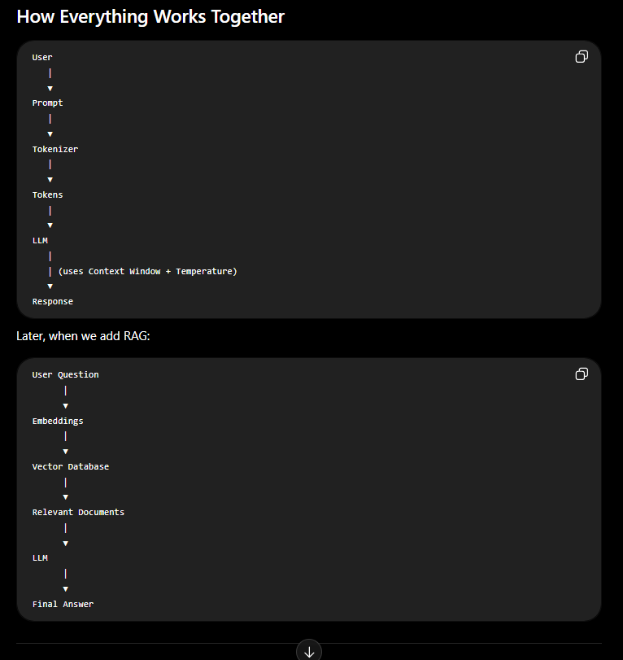

# Day 1 Notes — LLM Basics

Core terms you need before building with GenAI / LLMs.

---

### 1. What is an LLM?

- **LLM = Large Language Model**

- Large ==> A trained on very large amount of data.
- Language ==> Understand nd generate human-language.
- Model ==> A trained program which that has learned statistical patterns from data.

- A deep-learning model that trained on huge amounts of text to understand and generate human-like language.
- Built using deep neural networks (usually Transformers)
- Learns patterns of language: grammar, meaning, style, reasoning patterns — not by “searching the internet” every time
- Predicts the next word (more precisely: next **token**) based on what came before
- **Examples:** GPT (ChatGPT), Claude, Gemini, Llama, Mistral, DeepSeek

**Simple idea:**  
You give text → the model predicts what should come next → that prediction becomes the reply.

---

### 2. What are Tokens?

- LLMs don’t read text as full words or sentences the way humans do
- Text is broken into smaller pieces called **tokens**
- A token can be:
  - a whole word (`hello`)
  - part of a word (`ing`, `tion`)
  - punctuation, spaces, or special symbols
- Rough rule of thumb (English): **1 token ≈ ¾ of a word** (or ~4 characters)
- Models have limits based on tokens (input + output count toward the limit)

**Example:**

| Text | Approx tokens |
| --- | --- |
| `Hi` | 1 |
| `ChatGPT` | 2–3 |
| `I love learning AI` | ~5 |

**Why it matters:**  
Pricing, context limits, and response length are all measured in tokens.

---

### 3. What is a Context Window?

- The **maximum amount of text (in tokens)** an LLM can consider at one time(request/conversation)
- Includes:
  - your prompt / conversation history
  - system instructions
  - the model’s generated reply
- If content goes beyond the window, older parts may be dropped or ignored
- Bigger context window → model can handle longer chats, bigger docs, more code

**Examples (order of magnitude):**
- Older models: ~4K–8K tokens
- Modern models: 32K, 128K, 200K+ tokens (varies by model)

---

### 4. What is Temperature?

- A setting that controls how **creative or predictable** the model’s output is
- Affects randomness when choosing the next token

| Temperature | Behavior | Best for |
| --- | --- | --- |
| **Low (0–0.3)** | More focused, predictable, consistent | Code, facts, extraction, classification |
| **Medium (0.5–0.8)** | Balanced | General chat, writing help |
| **High (0.9–1.5+)** | More creative, varied, sometimes surprising | Brainstorming, stories, ideation |

- Temperature **0** → almost always picks the most likely next token (very stable)
- Higher temperature → more chance of less-likely tokens (more variety)

**Note:** Higher creativity can also mean more mistakes/hallucinations.

---

### 5. What is a Prompt?

- The **input** you give to an LLM
- Can include:
  - a question
  - instructions
  - examples
  - context / documents
  - role (“You are a helpful coding tutor…”)
- Prompt quality strongly affects output quality (“garbage in, garbage out”)

**Types (informal):**
- **System prompt** — overall rules / behavior
- **User prompt** — what the user asks
- **Few-shot prompt** — includes examples of desired input→output

**Example prompt:**
> Explain tokens like I’m a beginner, in 3 bullet points.

---

### 6. What is a Completion / Response?

- The **output** the model generates after reading your prompt
- Also called: completion, response, generation, answer
- Technically, the model is “completing” the text sequence started by your prompt
- In chat apps, this looks like the assistant’s message
- In APIs, you’ll often see fields like `completion` or `message.content`

**Flow:**

```text
Prompt (input)  →  LLM  →  Completion / Response (output)
```

---

### 7. What are Embeddings? (High Level)

- An **embedding** is a numerical representation (a list of numbers / vector) of the meaning of text (or image, etc.)
- Similar meanings → similar vectors (close in “vector space”)
- Models use embeddings to capture semantic meaning, not just exact words

**Why useful:**
- Search by meaning (semantic search)
- Recommendations
- Clustering / classification
- RAG (Retrieval-Augmented Generation) — find relevant docs before asking the LLM

**Simple intuition:**

| Text | Idea |
| --- | --- |
| `"king"` and `"queen"` | Close vectors (related meaning) |
| `"king"` and `"pizza"` | Far apart (unrelated) |
| `"How do I reset my password?"` and `"I forgot my login credentials"` | Close (same intent, different words) |

**Key takeaway:**  
Embeddings turn language into numbers so machines can compare meaning mathematically.

---

### Quick recap

| Term | One-line meaning |
| --- | --- |
| **LLM** | Big model that generates language by predicting next tokens |
| **Token** | Small chunk of text the model reads/writes |
| **Context window** | How much text the model can consider at once |
| **Temperature** | Controls randomness / creativity of output |
| **Prompt** | Your input / instructions to the model |
| **Completion** | The model’s generated output |
| **Embeddings** | Number vectors that capture meaning of text |

---

### Key takeaway

- LLMs work with **tokens**, not whole documents as humans do
- Your **prompt** + history must fit in the **context window**
- **Temperature** tunes creativity vs consistency
- **Embeddings** help find “similar meaning” — foundation for search and RAG



