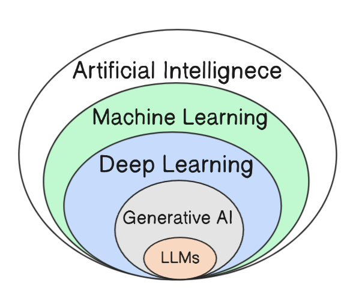
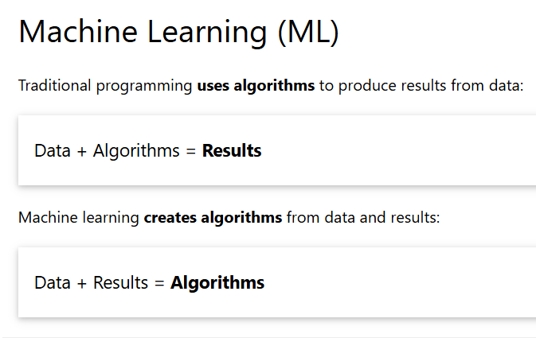
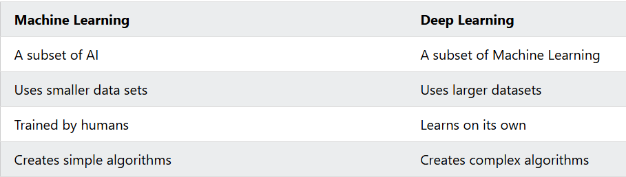

# Day 1 Notes

## Difference between AI, ML, DL and GenAI

These fields are nested — each one is a subset of the one outside it:

**Artificial Intelligence (AI) ⊃ Machine Learning (ML) ⊃ Deep Learning (DL) ⊃ Generative AI (GenAI) ⊃ LLMs**

---

### 1. Artificial Intelligence (AI)
- AI is the field of creating machines that can perform normally tasks that requires human intelligence.
- Includes reasoning, planning, perception, understanding language, decision-making, playing games
- Can be rule-based (hard-coded logic) or data-driven means we manually defines set of rules to machines and on that basis it gives output.
- It is 1950's concept.
- **Examples:** Google Maps finding the fastest route, Chess-playing computer, recommendation systems, voice assistants like Siri, Alexa, spam email detection, fraud detection, 

---

### 2. Machine Learning (ML)

- A subset of AI
- Here, instead of writing rules manually, we give data(input + output) to machine(algorithm).
- Systems learn patterns from data instead of only following explicit rules
- Improves performance with more/better data and training
- But when we consider complex data like images, videos, voice and large paragraphs and human language so here it fails, it only work good for text.
- **Examples:** Netflix recommends movies, Amazon recommends products, Instagram suggests reels, Google Translate, Face Unlock.
- INPUT + OUTPUT ==> Machine(Algorithm) ==> Machine learns patterns.

---

### 3. Deep Learning (DL)

- A subset of ML
- Uses artificial neuron networks for learning complex patterns or data
- Strong at complex, high-dimensional data: images, audio, text
- Needs large data and compute compared to classic ML
- **Examples:** Face Recognition, Speech Recognition, Google Lens,      Self-driving cars, ChatGPT, Gemini, Claude.
- There are 2 branches of Deep Learning :
   - NLP(Natural Language Processing) : texts and speech
   - CV(Computer Vision) : videos, images
---

#### Neuron Networks

- Neuron Networks are inspired by how human brain processes information.    
- A software that learns from mistakes

### Difference b/w ML and DL

### 4. Generative AI (GenAI)

- A subset of (mostly) deep learning
- creates new content
- uses LLM(Large Language Model) for creating content like chatgpt uses GPT which is a LLM.
- LLM is made from Neuro Network.
- Focuses on **creating** new content: text, images, audio, video, code
- It didn't search the internet live for that code. It generated the response based on patterns it learned during training.
- **Examples:** ChatGPT, DALL·E, Midjourney, music/code generators, Github Copilot

### Why is ChatGPT called Generative AI?
  Bcz ChatGPT generates response. It doesn't select from database.

---
### Relationship Between All Four

Imagine you own a restaurant.

AI = The whole restaurant.

Machine Learning = The chefs.

Deep Learning = Master chefs.

Generative AI = A chef who can invent completely new recipes.

---

### Quick comparison

| Field | What it is | Main idea | Example |
| --- | --- | --- | --- |
| **AI** | Broad umbrella | Make machines “smart” | Rule-based chatbot, game AI |
| **ML** | Subset of AI | Learn from data | Spam classifier |
| **DL** | Subset of ML | Deep neural networks | Face recognition |
| **GenAI** | Subset of DL (mostly) | Generate new content | Image/text generators |

---

### Key takeaway

- **All GenAI is not equally “just AI” in the casual sense** — GenAI sits inside DL → ML → AI
- **Not all AI is ML** (some AI is pure rules / logic)
- **Not all ML is DL** (classic ML like decision trees, SVM also counts)
- **Not all DL is GenAI** (many DL models only classify or predict, they don’t generate)
- **LLMs** (Large Language Models) are a popular type of GenAI focused on language
